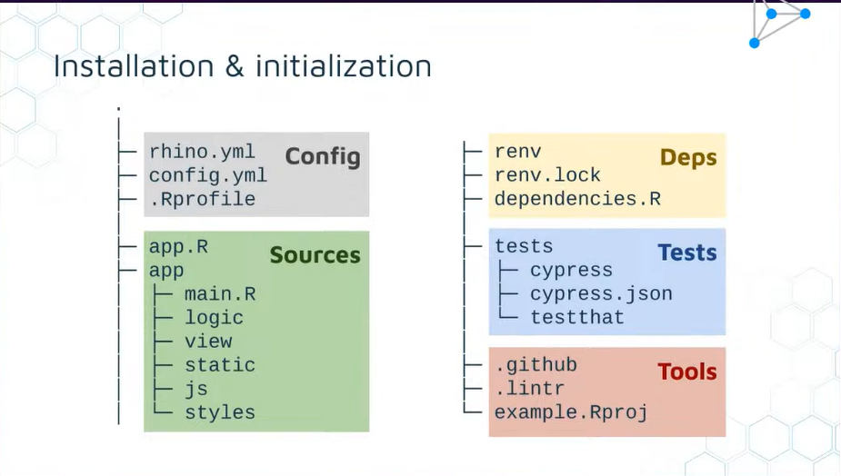

# Shiny-Rhino
- Rhino is a framework for enterprise shiny apps.
- Technically its an R package.
- You can start a Rhino project by running 
        `rhino::init("my_app")`

1. Rhino File Structure.

    a. Main Source Files/ sources
- app.R - 
- app - where the shiny application lives it contains
        - view - for shiny modules and related code 
        - logic - for application code independent of shiny
        - js - where the javascript files go into, with index.js as the entry point
        - styles - Sass code goes here and rhino sources the file for you. All you need to call is - - -    `rhino::build_sass()` function
        - static - Add static files here i.e. Images, favicons, and static files
        - main.R - Entry point for your application

    c. Configuration
- config.yml -is the configuration file for the rhino app
- .Rprofile
- rhino.yml

    d. Tests 
- tests - where to add unittests
      - cypress
      - cypress.json
      - test that

    e. Dependancies
- renv -
- renv.lock - take snapshots
- dependancies.r - add packages here

    f. Tools
- `.github`
- `.lints`
- example.Rproj

2. Code Architecture
- box i.e
        box::use(
            Shiny(Ns,moduleserver,Uioutput, renderUI))
- modules

3. Code Quality
    a. Linting - Refers to the process of analyzing code to detect potential errors, stylistic issues, and non-optimal coding practices.
            rhino::lint_r()
            rhino::lint_Sass()
            rhino::lint_js()
    b. Testing - Ensures that your app functions correctly and is reliable for its users.
            rhino::test_r()
            rhino::test_e2e()
    c. Logging - Critical aspect of software development and maintenance, providing a way to record events that happen during the execution of a program. 
            daroczig
            box::use(
                rhino(log),
            )
        
    d. Configuration - Configuration in the context of software development refers to the process and mechanism by which you define and manage the settings and parameters that influence the behavior of a software application.   
        - Store and retrieve variables from your shiny application i.e. 
                box::use(
                    config(get)
                )

Details
This function is a wrapper around `shiny::shinyApp()`. It reads rhino.yml and performs some configuration steps (logger, static files, box modules). You can run a Rhino application in typical fashion using shiny::runApp().

Rhino will load the app/main.R file as a box module (`box::use(app/main)`). It should export two functions which take a single id argument - the ui and server of your top-level Shiny module.

#Details
The recommended steps for migrating an existing Shiny application to Rhino:

Put all app files in the app directory, so that it can be run with `shiny::shinyAppDir("app")` (assuming all dependencies are installed).

If you have a list of dependencies in form of library() calls, put them in the dependencies.R file. If this file does not exist, Rhino will generate it based on `renv::dependencies("app")`.

If your project uses {renv}, put renv.lock and renv directory in the project root. Rhino will try to only add the necessary dependencies to your lockfile.

Run `rhino::init()` in the project root.

